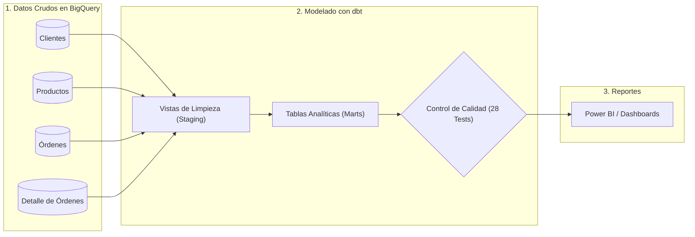

# Retail Analytics: Preparación y Modelado de Datos para Power BI/Data Studio con dbt y Google BigQuery

[](https://www.getdbt.com/)
[](https://cloud.google.com/bigquery)
[](https://docs.getdbt.com/docs/build/data-tests)
[](https://cloud.google.com/bigquery/docs/reference/standard-sql/en-US)
[](#contexto-del-proyecto-y-rol-del-analista)

---

## 📌 Contexto del Proyecto y Rol del Analista

En las empresas de comercio minorista (*Retail & E-commerce*), los datos de ventas, clientes y productos suelen llegar a la base de datos (BigQuery) con formatos desordenados, valores nulos, fechas en formatos de texto y sin las métricas clave que la gerencia necesita ver en sus reportes diarios.

Como **Analista de Datos**, en lugar de intentar limpiar millones de filas en hojas de cálculo o sobrecargar Power Query con transformaciones lentas, utilicé **dbt Core** para:
1. **Limpiar y estandarizar los datos crudos** directamente dentro de BigQuery usando SQL intermedio.
2. **Construir tablas analíticas consolidadas** con las métricas comerciales ya calculadas (Ventas netas, márgenes de ganancia, ticket promedio y segmentación de clientes).
3. **Validar la calidad de los datos** con pruebas automáticas para asegurar que ningún gráfico en Power BI muestre datos erróneos o incompletos.

---

## 🎯 Preguntas de Negocio que responde este Proyecto

Este modelo de datos fue diseñado para que el equipo comercial y de marketing pueda responder rápidamente en Power BI preguntas como:

* **Rendimiento de Ventas:** ¿Cuánto vendemos en bruto vs. cuánto descontamos en promociones? ¿Cuál es la facturación neta mensual?
* **Comportamiento de Clientes:** ¿Quiénes son nuestros clientes más valiosos (*VIP*)? ¿Qué porcentaje de clientes registrados aún no realiza su primera compra (*Prospects*)?
* **Rentabilidad de Productos:** ¿Cuáles artículos tienen el mejor margen de ganancia y cuáles representan el mayor volumen de unidades vendidas?
* **Efectividad de Canales:** ¿Por qué canal se concentran las mayores ventas: sitio web, aplicación móvil o tiendas físicas?

---

## 📂 Origen y Fuente de los Datos (Data Source)

Los datos crudos de este proyecto corresponden a un **dataset simulado de comercio minorista (*Retail & E-commerce Mock Data*)**, estructurado para emular la base de datos operacional de una empresa omnicanal (*Web*, *App móvil*, *Tienda física*) siguiendo el modelo relacional estándar del sector comercial (clientes, catálogo de productos y órdenes con estructura cabecera-detalle).

* **Propósito del Dataset:** Brindar un conjunto de datos controlado, realista y 100% reproducible que permita simular el ciclo analítico corporativo completo (ingesta, estandarización en staging, modelado dimensional y testing de calidad) sin exponer información confidencial de clientes reales (cumplimiento estricto de privacidad sin PII).
* **Ubicación en el repositorio:**
  * [`data/`](data/): Archivos crudos de origen en formato CSV, incluyendo el registro transaccional consolidado ([`raw_retail_transactions.csv`](data/raw_retail_transactions.csv)).
  * [`seeds/`](seeds/): Las 4 tablas crudas preparadas para su ingesta y versionado en dbt.
* **Carga en el Data Warehouse:** Se cargan automáticamente en Google BigQuery mediante el comando `dbt seed`.
* **Seguridad y Privacidad:** Datos sintéticos con correos bajo dominio de prueba `@example.com`.
* **Estructura de las tablas crudas:**
  * `raw_customers` (200 filas): Maestro de clientes, ubicación geográfica y fecha de registro.
  * `raw_products` (36 filas): Catálogo comercial con costos y precios de venta sugeridos.
  * `raw_orders` (1,000 filas): Encabezado de órdenes de compra con canal y estado del pedido.
  * `raw_order_items` (1,794 filas): Detalle de ítems por orden, cantidades y descuentos.

---

## 🔄 Flujo de Trabajo del Analista

El flujo sigue las mejores prácticas de la analítica moderna:



---

## 📊 Tablas Analíticas Creadas para los Reportes

El proyecto organiza los datos en tablas limpias y listas para conectar directamente con Power BI:

### 1. `fct_orders` (Resumen de Órdenes de Venta)
* **Objetivo:** Permite analizar las ventas a nivel de cada pedido.
* **Métricas calculadas:** Unidades totales por orden, monto de lista (`gross_amount`), descuentos otorgados (`total_discount_amount`), venta neta final (`net_amount`) y estado del pedido (`completed`, `returned`, `cancelled`).

### 2. `dim_customers` (Vista 360 del Cliente)
* **Objetivo:** Permite a marketing segmentar clientes y entender su fidelidad.
* **Métricas calculadas:**
  * Fecha de primer y último pedido.
  * Total de órdenes realizadas y órdenes exitosas.
  * **Customer Lifetime Value (LTV):** Gasto total acumulado por el cliente.
  * **Ticket Promedio (AOV):** Monto promedio por compra completada.
  * **Segmento del Cliente:**
    * 🌟 **VIP:** Clientes con gasto acumulado $\ge \$600$.
    * 🔁 **Frequent:** Clientes con 3 o más compras.
    * 👤 **Active:** Clientes con 1 o 2 compras.
    * 🎯 **Prospect:** Usuarios registrados sin compras efectivas.

### 3. `dim_products` (Catálogo y Rentabilidad Comercial)
* **Objetivo:** Ayuda a compras y finanzas a medir qué productos son rentables.
* **Métricas calculadas:** Unidades totales vendidas, ingresos brutos, ingresos netos reales, porcentaje de margen comercial y **ganancia total estimada**.

---

## 🛡️ Control de Calidad: ¿Por qué usamos `dbt test`?

Uno de los errores más comunes de un analista novato es conectar Power BI directamente a datos crudos y que el reporte falle en plena presentación ejecutiva por culpa de datos rotos.

Para evitar eso, definí **28 pruebas automáticas** que se ejecutan en BigQuery antes de que los datos toquen Power BI:

* **Sin duplicados (`unique`):** Verificamos que ningún cliente ni orden esté duplicado.
* **Sin campos vacíos (`not_null`):** Garantizamos que las ventas, fechas y claves primarias nunca vengan vacías.
* **Integridad entre tablas (`relationships`):** Aseguramos que cada producto y cliente en una orden exista realmente en el catálogo maestro.
* **Valores de negocio válidos (`accepted_values`):** Comprobamos que los estados de pedidos solo correspondan a los permitidos por el negocio (`completed`, `shipped`, `returned`, `cancelled`, `processing`).

---

## 💡 Cálculo Consistente de Márgenes (Macro en Jinja)

Para que ningún analista del equipo calcule el margen de ganancia de forma distinta o cometa errores al dividir por cero, creamos una fórmula estandarizada y reutilizable en [`macros/calculate_margin_pct.sql`](file:///c:/Users/ismar/Downloads/dbt/macros/calculate_margin_pct.sql):

```sql

    round(safe_divide(cast({{ list_price }} as numeric) - cast({{ cost_price }} as numeric), cast({{ list_price }} as numeric)) * 100, 2)

```
De esta forma, cualquier reporte comercial utiliza exactamente la misma definición de margen.

---

## 📈 Conexión con Herramientas de BI (Power BI / Data Studio)

Al conectar con **Power BI** o **Data Studio (Looker Studio)**:
1. Conectar mediante el conector nativo de **Google BigQuery**.
2. Seleccionar el dataset `dbt_dev` y marcar las 3 tablas preparadas: `dim_customers`, `dim_products` y `fct_orders`.
3. Relacionar mediante `customer_id` y `product_id`.
4. Como las métricas clave ya están precalculadas en dbt, los modelos y dashboards quedan livianos, rápidos y sin necesidad de fórmulas DAX excesivas.

---

## 🚀 Cómo Reproducir este Proyecto Localmente

1. **Clonar este repositorio:**
   ```bash
   git clone https://github.com/rubenbarrios-bigdata/retail-analytics-dbt.git
   cd retail-analytics-dbt
   ```

2. **Crear y activar entorno virtual en Windows:**
   ```powershell
   python -m venv .venv
   .venv\Scripts\activate
   pip install dbt-core dbt-bigquery
   ```

3. **Configurar credenciales:**
   Configurar el archivo `profiles.yml` en la carpeta `~/.dbt/` apuntando a tu proyecto de Google Cloud BigQuery.

4. **Ejecutar el modelado en dbt:**
   ```powershell
   # 1. Comprobar conexión
   dbt debug

   # 2. Cargar datos de prueba (1,000 órdenes y 200 clientes)
   dbt seed

   # 3. Limpiar y modelar los datos
   dbt run

   # 4. Correr las pruebas de calidad
   dbt test

   # 5. Ver la documentación interactiva en el navegador
   dbt docs generate
   dbt docs serve
   ```

---

## 👨‍💻 Autor

**Rubén Barrios**

Proyecto realizado como práctica de modelado de datos con dbt y BigQuery, orientado a seguir consolidando el desarrollo profesional en el área de Data Analytics.

